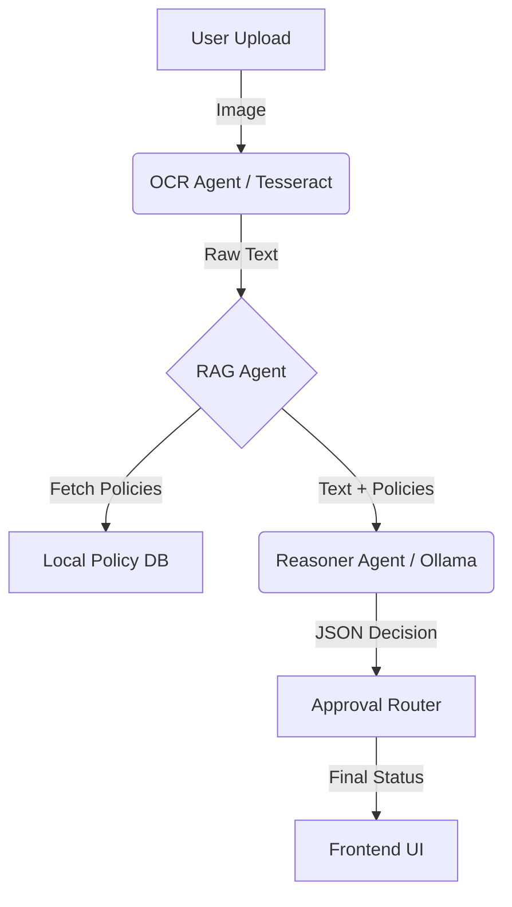

# System Architecture

## Overview
The Expense Approval Agent uses a **Local Agentic RAG (Retrieval-Augmented Generation)** architecture. This ensures data privacy (receipts never leave the machine) and zero operational costs (no specialized cloud APIs required).

## data Flow

1.  **User Upload**: User uploads a receipt image via the Next.js Frontend.
2.  **Perception Layer (OCR Agent)**:
    *   **Tool**: `Tesseract.js` (running in a Node.js worker).
    *   **Action**: Extracts raw text from the image.
    *   **Fallback**: If OCR fails or times out (>30s), a mock receipt text is generated to ensure the demo flow continues.
3.  **Retrieval Layer (RAG Agent)**:
    *   **Tool**: Local Keyword Search Algorithm.
    *   **Knowledge Base**: `lib/policies.json`.
    *   **Action**: Filters the company policy database to find clauses relevant to the extracted text (e.g., matching "Uber" to "Travel Policy").
4.  **Reasoning Layer (Reasoner Agent)**:
    *   **Tool**: **Ollama** running **Mistral 7B** locally.
    *   **Prompting**: A structured prompt is sent to the LLM containing the *Receipt Text* and *Relevant Policies*.
    *   **Task**: The LLM compares the expense against the rules and outputs a JSON decision (`Approve`, `Reject`, `Risk Score`).
    *   **Resiliency**: If Ollama is offline or times out (>60s), the system strictly follows a rule-based fallback logic to provide an immediate decision.
5.  **Decision Layer (Fraud & Routing)**:
    *   **Fraud Agent**: Checks for duplicate submission hashes.
    *   **Approval Router**: Routes the request based on the AI's decision and the amount (e.g., < $800 Auto-Approve).

## visual Diagram

